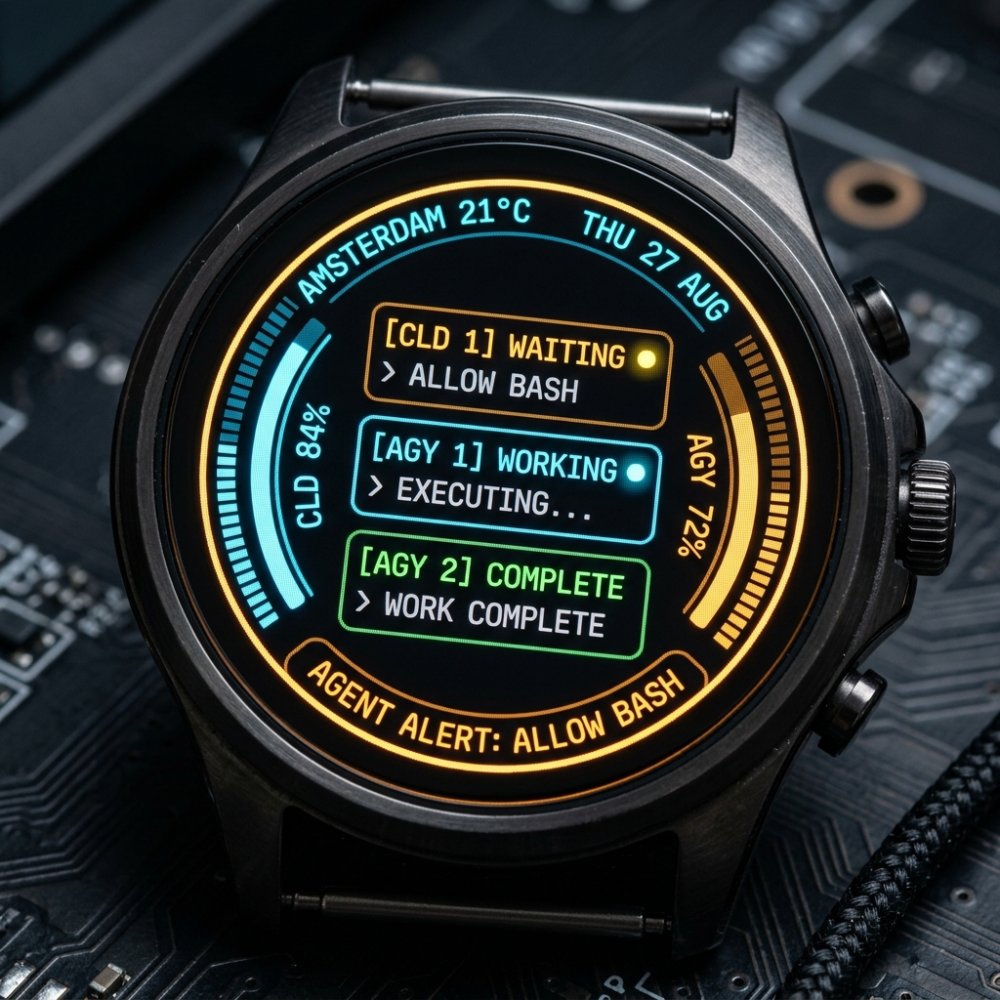

# ⚡ Tiny AI Limits & Desktop Companion (ESP32-C3)

[](https://kimishiba.github.io/Tiny-AI-Limits/)


An open-source, Wi-Fi enabled desktop telemetry companion powered by the ultra-compact **ESP32-C3 SuperMini** microcontroller.

👉 **[Try the In-Browser Hardware Simulator & Showcase Site](https://kimishiba.github.io/Tiny-AI-Limits/)**

It brings your AI developer environment to life with physical desktop hardware — monitoring real-time token quotas for **Claude Code** and **Google Antigravity CLI**, alerting you when AI agents require plan approvals, and serving as an expressive animated desk companion and synchronized clock.


---

## 🛠️ The Hardware You Can Build

**Tiny AI Limits** is built around a single physical form factor: the **GC9A01 1.28" Circular IPS Cyberdeck Edition**.

<p align="center">
  
  &nbsp;&nbsp;&nbsp;&nbsp;
  
</p>

An industrial sci-fi desktop pod featuring a vibrant **1.28" Circular 240×240 IPS Color Display (GC9A01 SPI)** resting at an ergonomic $18^\circ$ backward tilt on a two-tier modular pedestal.

### ✨ Features:
* **Multi-Agent Status Monitor:** Dynamically replaces the central split-flap clock with a real-time HUD showing live agent activity across Claude Code CLI and Google Antigravity sessions (`WAITING 🟡`, `WORKING 🔵`, `COMPLETE 🟢`).
* **2×2 Split-Flap Flip Clock:** Mechanical split-card matrix animating hour and minute transitions when all agents are idle.
* **Universal Multi-Provider Gauges:** Independently assign any AI service to the Left and Right radial arcs (Claude, Google Antigravity, OpenRouter, DeepSeek, Groq, Mistral).
* **Standard Quota vs Enterprise Spend Modes:**
  * **Standard Quota Mode:** Real-time percentage remaining ($0\% \to 100\%$) and 5-hour rolling reset countdown timer (e.g. `4h 32m`).
  * **Enterprise / PAYG Mode:** Live calendar-day expenditure in **USD ($)** (e.g. `$0.13`), 24-hour token volume in the footer (`28.2k TOK`), and radial arc progression against a customizable **Daily Budget ($ USD)**.
* **Automatic Multi-Model Pricing:** Companion backend automatically scans local transcript turns and calculates exact pricing per model (Sonnet 3.7 / 3.5, Haiku, Opus, cache read/write).
* **Top Crown Connection & Rain Forecast:** Live telemetry heartbeat pulse and rain status (`Rain in 3h`, `Rain Now`, `No Rain`).
* **Stacked Bottom Sub-HUD:** Day & Date, live temperature with weather condition icons, and real-time **Agent Attention Alert** banner overrides (`AGENT ALERT: ALLOW BASH`, `ANSWER Q`, `APPROVE PLAN`).
* **Enclosure Architecture:** Support-free 3D-printable pod with $4\times$ counterbored brass M3 socket head cap screws, raised decorative ring, and a two-tier pedestal stand (Dark Walnut wood base plate with 4 alignment pillars + matte dark truncated trapezoidal cradle trunk).

<p align="center">
  
</p>

---

## 📊 Specifications

| Aspect | Detail |
| :--- | :--- |
| **Display Type** | 1.28" Round Color IPS (240×240) |
| **Interface** | High-Speed SPI |
| **Primary Theme** | Cyberdeck Split-Flap Clock & Dual Radial HUD |
| **Multi-Agent HUD** | Real-Time 3-Row Agent State Matrix (`WAITING`, `WORKING`, `COMPLETE`) |
| **Claude & Antigravity Gauges** | Dual Continuous $180^\circ$ Radial Arcs |
| **Agent Approval Warning** | High-Contrast Yellow/Orange Sub-HUD Alert + Kinetic Amber Hazard Ring |
| **Weather & Rain Forecast** | Top Crown Indicator + Temperature Sub-HUD |
| **Desk Stand** | Modular Two-Tier Pedestal (Walnut + Cradle) |

---

## 🛒 Bill of Materials (BOM) & Purchasing Guide

For a complete parts list, exact component specifications, and direct purchasing links (**Amazon**, **AliExpress**, **Waveshare**, **Adafruit**), see the dedicated BOM documentation:

* 📦 [**`BOM/README.md`**](bom/README.md) — Quick-Start Shopping Kit & Assembly Cost Summary.
* 📋 [**`BOM/BOM.md`**](bom/BOM.md) — Comprehensive Bill of Materials with verified purchasing links.

---

## 🔌 Hardware & Wiring Schematics

### 1. ESP32-C3 SuperMini Pinout (Microcontroller)
The ultra-compact ESP32-C3 SuperMini board powers the device via USB-C (3.3V logic).

---

### 2. GC9A01 Circular Display Wiring (Hardware SPI)

| GC9A01 Display Pin | ESP32-C3 SuperMini Pin | Description |
| :--- | :--- | :--- |
| **VCC** | **3V3** | 3.3V Power Rail |
| **GND** | **GND** | Ground |
| **SCL / SCLK** | **GPIO 4** | SPI Clock |
| **SDA / MOSI** | **GPIO 6** | SPI MOSI (Data) |
| **DC** | **GPIO 7** | Data / Command Control |
| **CS** | **GPIO 5** | Chip Select |
| **RST / RES** | **GPIO 1** | Hardware Reset |
| **BLK** | **GPIO 0** (or 3V3) | Backlight PWM / Enable |

*(For breadboard hookup instructions, see [`WIRING.md`](WIRING.md)).*

---

## 🖨️ 3D Printing & Enclosure Assembly

All enclosure CAD models are **100% support-free FDM 3D printable** and available in both parametric OpenSCAD sources and verified watertight STLs:

### Models Included (`round 240x240/enclosure/`):
* `gc9a01_front_bezel.stl` — Front bezel display carrier with anti-shadow conical bevel and M3 counterbores.
* `gc9a01_main_housing.stl` — Enclosure bucket with lowered USB-C port and M3 corner pilot holes.
* `gc9a01_stand_tier1_base.stl` — Tier 1 base plate with 4 alignment pillars and rubber feet recesses (ideal for wood PLA or dark walnut).
* `gc9a01_stand_tier2_trunk.stl` — Tier 2 sculpted monolithic pedestal trunk with 4 slide sockets and $18^\circ$ V-saddle cradle notch.
* `gc9a01_desk_stand.stl` — Unified single-piece monolithic desk stand.

---

## 📖 Frequently Asked Questions (FAQ)

Have questions about the project, components, or setup? Check out the [FAQ](FAQ.md) for quick answers!

---

## 🚀 Getting Started

### 1. Build & Flash Firmware
Using **PlatformIO**:

```bash
# Build firmware
python -m platformio run

# Upload to ESP32 over USB-C
python -m platformio run --target upload
```

### 2. Launch the PC Companion Backend
The companion service monitors your local AI agent transcripts, queries live Antigravity token limits, fetches local weather data, and advertises itself via zero-config mDNS:

```bash
# Install dependencies
pip install -r backend/requirements.txt

# Launch backend (or double-click TinyScreen.command on macOS)
python backend/app.py
```

### 3. USB WiFi Provisioning & Gauge Customization
With the device plugged in via USB-C, open **[`http://localhost:5000/setup`](http://localhost:5000/setup)** in Google Chrome or Microsoft Edge:
1. **Wi-Fi Setup:** Select the board's serial port, scan for networks, and enter your credentials. This also pairs the board to your machine.
2. **Configure Dual HUD Gauges:** Choose which AI service appears on the **Left** and **Right** radial arcs (Anthropic Claude, Google Antigravity, OpenRouter, DeepSeek, Groq, Mistral).
3. **Select Plan / Usage Mode per Provider:**
   * **Standard Quota (5h / Hourly Reset Timer):** Ideal for Claude Pro / Antigravity standard plans with 5-hour rolling quotas. Displays $\%$ remaining and time until quota resets (`4h 32m`).
   * **Enterprise Mode (Spend in $ & 24h Tokens):** Ideal for Enterprise, Team, or Pay-As-You-Go accounts. Displays live spend in **`$`** inside the corridor card (`$0.13`), total 24h token volume in the footer (`28.2k TOK`), and tracks progress against your customizable **Daily Budget ($ USD)**.
4. **Custom Cloud API Keys:** For cloud LLMs (OpenRouter, DeepSeek, Mistral, Groq), enter your API key in the collapsible accordion.

---

## 🔗 Multiple Boards on One Network

If several people run Tiny AI Screen on the same Wi-Fi (a shared office or household), each board needs to know *which* companion app is its own. Otherwise a board can pick up a colleague's app and display their Claude Code / Antigravity quotas.

**Pairing** solves this. Each companion app generates a stable `pair_id` (stored in `~/.tiny_ai_screen/config.json`), and a paired board talks only to the computer it was paired with.

* **Direct Serial Setup** (recommended) pairs the board automatically — no extra step.
* **"Connect & Set Up WiFi"** (Improv) can only send Wi-Fi credentials; the protocol has no room for an address. After it finishes, pair the board with the **"Pair an Existing Board"** box on the setup page, entering the board's IP.
* If your computer's IP changes (DHCP lease renewal), a paired board re-finds it automatically by matching `pair_id` against the mDNS TXT records. If that fails, re-pair with the same box.

**Pairing is one-way.** Once a board has been paired, it never goes back to picking whichever companion answers first — even if it loses track of its host. It will show no data and wait to be re-paired rather than risk reading someone else's stats.

**The top crown status arc tells you which mode a board is in:**

| Status Arc | Meaning |
| --- | --- |
| Green arc (pulsing) | Paired & connected, reading from your companion app |
| Amber arc | Connected but **unpaired** — the figures may not be yours |
| Red arc | No connection |

Each board also claims a unique mDNS name derived from its MAC — `tinyscreen-F030.local` rather than a shared `tinyscreen.local` — so several boards can coexist on one subnet.

> **Upgrading an existing board?** Boards flashed before pairing existed keep working: they fall back to mDNS discovery, and show the amber/unpaired indicator while they do. That fallback is exactly what can latch onto the wrong companion, so **re-run Direct Serial Setup once** after updating the firmware. After that the board is pinned for good.

---

## 🎨 Interactive Browser Prototype & Visualizer

Preview and interact with all screens, animations, and telemetry states in real time:

* **Full Display Emulator:** `http://localhost:5000/emulator`

---

## 📂 Repository Structure

```
├── backend/                  # Python Flask companion service & token trackers
│   ├── app.py
│   └── claude_statusline.py
├── round 240x240/            # GC9A01 1.28" Round IPS Edition
│   ├── enclosure/            # Parametric OpenSCAD & watertight STLs
│   │   ├── generate_stl.py
│   │   ├── gc9a01_cyberdeck_enclosure.scad
│   │   ├── gc9a01_front_bezel.stl
│   │   ├── gc9a01_main_housing.stl
│   │   ├── gc9a01_stand_tier1_base.stl
│   │   ├── gc9a01_stand_tier2_trunk.stl
│   │   └── gc9a01_desk_stand.stl
│   └── assets/               # 3D concept renders, animated demo GIF & mascot frames
│       ├── gc9a01_3d_enclosure_render.jpg
│       └── gc9a01_round_display_demo.gif
├── emulator/                 # Interactive browser visualizers & emulators
│   ├── index.html            # Canvas emulator for the round HUD
│   └── setup.html            # WebSerial USB Wi-Fi provisioning
├── img/                      # 3D product renders & animation demos
├── src/                      # ESP32-C3 Arduino C++ firmware
│   └── main.cpp
├── platformio.ini            # PlatformIO build configuration
├── WIRING.md                 # Detailed pinout & wiring documentation
└── README.md
```

---

## 📄 License
MIT License. Feel free to build, customize, and share your own desktop AI companion!
