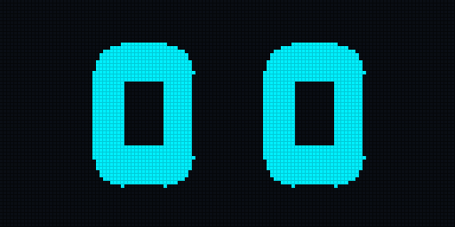

# ESP32 AI Companion & Tiny Screen (QBIT-Style Robot)


An open-source, Wi-Fi enabled desktop companion robot powered by the ultra-compact **ESP32-C3 SuperMini** microcontroller and a **0.96" 128x64 I2C OLED Display (SSD1306)**.

It combines an expressive, retro animated robot face with real-time hardware gauges for your AI coding token quotas (Claude Code & Antigravity CLI), agent plan approval notifications, and local weather forecasts.

<p align="center">
  
</p>

---

## ✨ Key Features

- **👀 Expressive Animated Face & Blinking Engine:**
  - 30 FPS non-blocking animation engine with natural eyelid physics and saccadic eye movements (looking center, left, right, and up).
  - Randomized blinking intervals with realistic double-blinks.
  - **Mood Reactions:**
    - *Normal Idle:* Friendly, calm blinking and glancing.
    - *Low Quota (< 20%):* Droopy/sleepy eyes with animated falling sweat droplets.
    - *Agent Attention Alert:* Flashes shocked wide eyes and a retro warning banner when an AI coding agent is waiting for user approval.
- **📊 Real-Time AI Quota Monitoring:** Monitors Claude Code token consumption and Antigravity CLI quota percentage.
- **🌦️ Local Weather & Digital Clock:** Displays temperature, rain forecasts, and live synchronized time.
- **🔄 Auto-Cycling Companion Screens:** Cycles smoothly between Full Face (8s) $\rightarrow$ Split HUD (8s) $\rightarrow$ Detailed Quotas (8s) $\rightarrow$ Clock & Weather (8s).
- **📡 Automatic Zero-Config mDNS Backend Discovery:** The ESP32 discovers your PC's companion backend automatically via `tiny-ai-companion.local`—no need to hardcode local IP addresses!
- **📶 Robust Wi-Fi Connectivity:** Tuned RF TX power to prevent voltage brownouts on USB power, with PMF auto-negotiation compatibility for mixed WPA2/WPA3 enterprise routers.
- **🖥️ Web Simulator & Prototype:** Interactive browser visualizer (`/faces` or `/emulator`) to test all 10+ robot emotions and companion states.
- **🖨️ 3D-Printable Enclosure:** Parametric OpenSCAD and STL files included in `enclosure/` for desktop casing.

---

## 🛠️ Hardware & Pinout

### Required Components
- **Microcontroller:** [ESP32-C3 SuperMini Development Board](https://nl.aliexpress.com/item/1005006121404100.html) (RISC-V 160MHz, Wi-Fi & BLE, USB-C)
- **Display Module:** 0.96" or 1.3" I2C Monochrome OLED Display (128x64, SSD1306 / SH1106)
- **Wiring:** 4x Female-to-Female or Male-to-Male Dupont jumper wires

### Standard Wiring Table (Hardware I2C)

| OLED Pin (0.96" SSD1306) | ESP32-C3 SuperMini Pin | Description |
| :--- | :--- | :--- |
| **GND** | **GND** (Pin 2, Left Header) | Ground |
| **VCC** | **3V3** (Pin 3, Left Header) | 3.3V Power |
| **SCL / SCK** | **GPIO 9** (Pin 13, Right Header) | I2C Clock (400 kHz) |
| **SDA** | **GPIO 8** (Pin 14, Right Header) | I2C Data |

*(For alternative 4-in-a-row pinouts or breadboard layouts, see [WIRING.md](WIRING.md)).*

---

## 🚀 Getting Started

### 1. Configure Wi-Fi Credentials
Copy `src/secrets.h.example` to `src/secrets.h` and configure your network:

```bash
cp src/secrets.h.example src/secrets.h
```

```cpp
#pragma once

const char* ssid = "YOUR_WIFI_SSID";
const char* password = "YOUR_WIFI_PASSWORD";
const char* backend_url = "http://tiny-ai-companion.local:5000/data";
```

### 2. Build & Flash Firmware
Using **PlatformIO**:

```bash
# Build firmware
python3 -m platformio run

# Upload to ESP32 over USB-C
python3 -m platformio run --target upload
```

### 3. Run the PC Companion Backend
The companion service monitors your local AI agent transcripts and weather data, hosting the REST endpoint for the ESP32:

```bash
# Install dependencies
pip install flask requests

# Launch backend (or double-click TinyScreen.command on macOS)
python3 backend/app.py
```

---

## 🎨 Interactive Browser Prototype

You can test and preview all face animations and companion states without flashing hardware:

1. Start the backend: `python3 backend/app.py`
2. Open in your browser:
   * **Robot Face Visualizer:** `http://localhost:5000/faces`
   * **Full Display Emulator:** `http://localhost:5000/emulator`

---

## 📂 Project Structure

```
├── backend/                  # Python Flask companion service & token trackers
│   └── app.py
├── enclosure/                # 3D printable case models & assembly guide
│   ├── top_case.stl
│   ├── bottom_base.stl
│   └── desk_console_oled13_esp32c3.scad
├── emulator/                 # Interactive browser visualizers & emulators
│   ├── qbit_faces_prototype.html
│   └── index.html
├── tools/                    # Asset generators (GIF animator, format converters)
│   └── generate_preview_gif.py
├── src/                      # ESP32-C3 Arduino firmware & secrets template
│   ├── main.cpp
│   └── secrets.h.example
├── platformio.ini            # PlatformIO board & library configuration
├── WIRING.md                 # Detailed pinout & wiring schematics
└── README.md
```

---

## 📄 License
MIT License. Feel free to use, modify, and build your own desktop companion!
