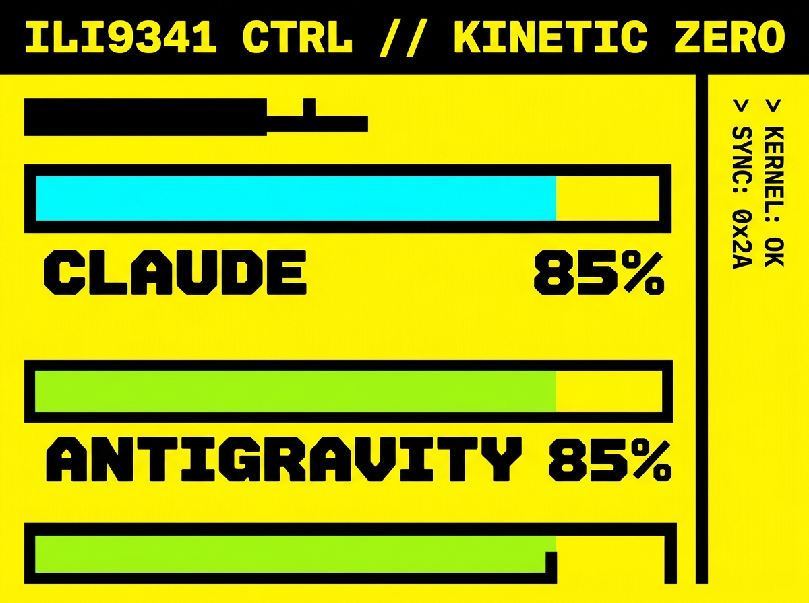
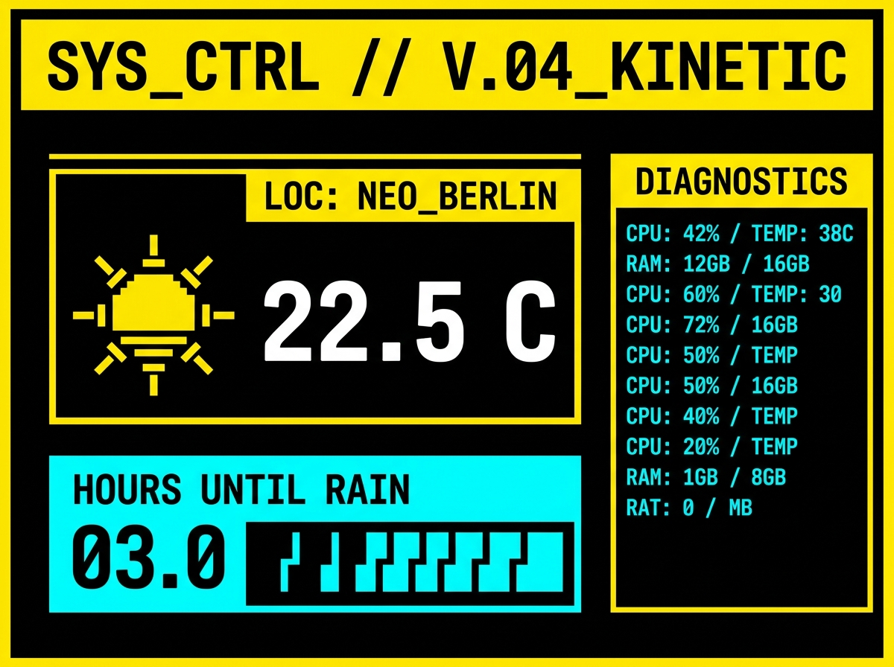

# ESP32-AI-Companion


An interactive, Wi-Fi enabled desktop companion monitor powered by an ESP32 micro-controller and a 1.5-inch 360x360 Round TFT Screen (ST77916 driver). It acts as a dedicated hardware gauge for your AI token limits and quotas.

<p align="center">
  
  &nbsp;
  
</p>

## Hardware & Components

- **Microcontroller Board:** [ESP32-WROOM-32 Development Board](https://www.espressif.com/en/products/socs/esp32) (38-pin / 30-pin Dual-Core 240MHz Wi-Fi & BLE)
- **Display Module:** [1.5" 360x360 Round TFT Display (ST77916 Driver, SPI / QSPI Interface)](https://nl.aliexpress.com/item/1005009628336342.html)
- **Power Supply / Cable:** Micro-USB / USB-C 5V Cable
- **Jumper Wires:** Dupont / Breadboard Jumper Wires for SPI connection

## Key Features
- **Live Limits Monitoring:** Fetches Claude Code token consumption and Antigravity quota limits directly from your computer.
- **Weather Forecast:** Auto-detects your location and displays the current temperature and hours until the next rain.
- **Smooth UI Animations:** Clean presentation designed specifically for circular screen geometry.
- **Wi-Fi Connectivity:** Fully wireless data sync over local Wi-Fi via a lightweight local Python backend.

## Getting Started

### 1. Wiring the Display
Connect your ST77916 1.5" Round Display to the ESP32 following the detailed pinout guide in [WIRING.md](WIRING.md).

### 2. ESP32 Firmware
1. Open this repository in VS Code with the PlatformIO extension.
2. Edit the Wi-Fi credentials (`ssid`, `password`) and your PC's IP address (`backend_url`) in `src/main.cpp`.
3. Build and upload the firmware to your ESP32.

### 3. PC Backend
The ESP32 pulls data from a lightweight Python Flask server running on your PC, which automatically scans local log files for token usage and asks the CLI for quota limits.
```bash
cd backend
pip install flask
python app.py
```

