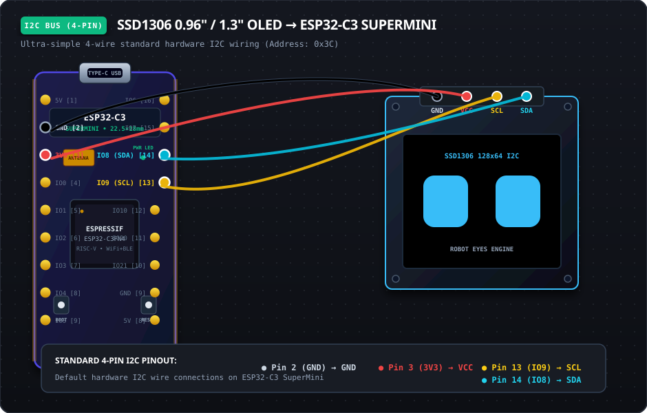

# ⚡ Hardware Wiring Guide: ESP32-C3 SuperMini

This guide provides complete visual wiring diagrams and pin mapping references for connecting both display options to the **ESP32-C3 SuperMini**.

---

## 🔘 Option 1: GC9A01 1.28" Circular IPS Display (SPI)

The GC9A01 circular display communicates over high-speed hardware **SPI**.

<p align="center">
  
</p>

### 📍 GC9A01 SPI Pin Mapping:

| Display Pin (GC9A01) | ESP32-C3 SuperMini Pin | Physical Header Location | Wire Color Cue | Description |
| :--- | :--- | :--- | :--- | :--- |
| **VCC** | **3V3** | Left Header (Pin 3) | 🔴 **Red** | 3.3V Power Supply |
| **GND** | **GND** | Left Header (Pin 2) | ⚫ **Black / Slate** | Common Ground |
| **SCL / SCK** | **GPIO 4** | Left Header (Pin 8) | 🟡 **Yellow** | Hardware SPI Clock |
| **SDA / MOSI** | **GPIO 6** | Right Header (Pin 16) | 🔵 **Cyan** | Hardware SPI MOSI (Data) |
| **DC** | **GPIO 7** | Right Header (Pin 15) | 🟢 **Green** | Data / Command Selection |
| **CS** | **GPIO 5** | Left Header (Pin 9) | 🟣 **Purple** | SPI Chip Select |
| **RST / RES** | **GPIO 1** | Left Header (Pin 5) | 🟠 **Orange** | Hardware Reset |
| **BLK** | **GPIO 0** | Left Header (Pin 4) | 🌸 **Pink** | Backlight Control (PWM/On-Off) |

---

## 📺 Option 2: SSD1306 0.96" / 1.3" Monochrome OLED (I2C)

The SSD1306 OLED utilizes standard hardware **I2C** (`Address: 0x3C`).

<p align="center">
  
</p>

### 📍 Standard Hardware I2C Pin Mapping:

| OLED Pin (SSD1306) | ESP32-C3 SuperMini Pin | Physical Header Location | Wire Color Cue | Description |
| :--- | :--- | :--- | :--- | :--- |
| **GND** | **GND** | Left Header (Pin 2) | ⚫ **Black / Slate** | Common Ground |
| **VCC** | **3V3** | Left Header (Pin 3) | 🔴 **Red** | 3.3V Power Supply |
| **SCL / SCK** | **GPIO 9** | Right Header (Pin 13) | 🟡 **Yellow** | Hardware I2C Clock |
| **SDA** | **GPIO 8** | Right Header (Pin 14) | 🔵 **Cyan** | Hardware I2C Data |

---

## 📍 ESP32-C3 SuperMini Physical Pin Reference

Looking at the board top-down with the **USB-C port pointing UP**:

```
                       [ USB-C PORT ]
                   +--------------------+
         [ 5V  ] --|  [1]          [16] |-- [ GPIO6  ] ---> GC9A01 SDA (MOSI)
         [ GND ] --|  [2]          [15] |-- [ GPIO7  ] ---> GC9A01 DC
         [ 3V3 ] --|  [3]          [14] |-- [ GPIO8  ] ---> OLED SDA
 GC9A01 -[ GPIO0] -|  [4]          [13] |-- [ GPIO9  ] ---> OLED SCL
 GC9A01 -[ GPIO1] -|  [5]          [12] |-- [ GPIO10 ]
         [ GPIO2] -|  [6]          [11] |-- [ GPIO20 / RX ]
         [ GPIO3] -|  [7]          [10] |-- [ GPIO21 / TX ]
 GC9A01 -[ GPIO4] -|  [8]          [9]  |-- [ GND    ]
 GC9A01 -[ GPIO5] -|  [9]          [8]  |-- [ 5V     ]
                   +--------------------+
```

---

## 🔁 "Adjacent 4-Pin" Alternative for OLED (Left Side Only)

Because the ESP32-C3 allows mapping I2C to any GPIO, you can also wire all 4 pins in an unbroken row on the left header by changing two lines in [`src/main.cpp`](src/main.cpp):

```cpp
#define I2C_SDA_PIN 0
#define I2C_SCL_PIN 1
```

With this, your 4 breadboard jumpers sit side-by-side on pins `[2]`, `[3]`, `[4]`, `[5]`:
- **GND** $\rightarrow$ Pin 2 (`GND`)
- **VCC** $\rightarrow$ Pin 3 (`3V3`)
- **SDA** $\rightarrow$ Pin 4 (`GPIO 0`)
- **SCL** $\rightarrow$ Pin 5 (`GPIO 1`)

