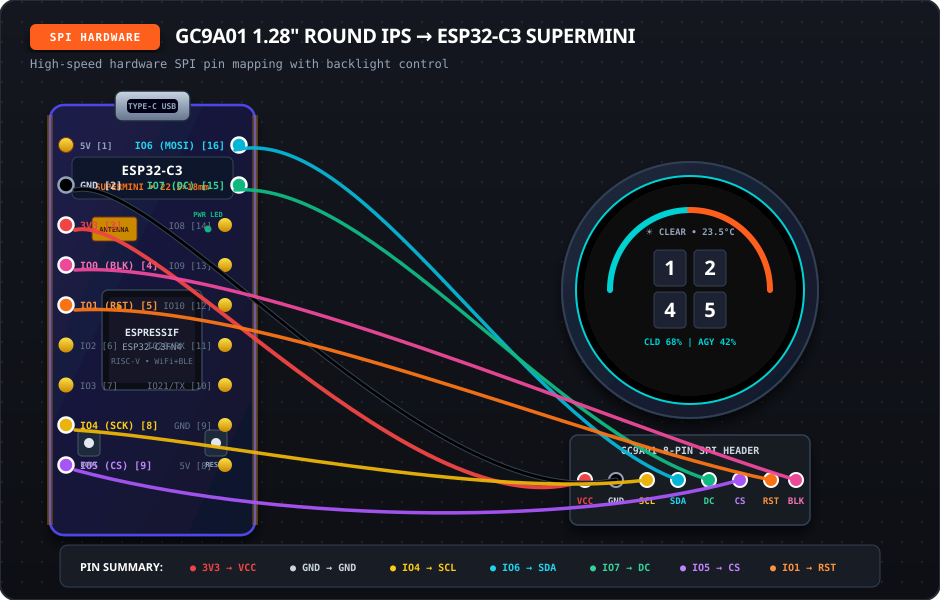

# ⚡ Hardware Wiring Guide: ESP32-C3 SuperMini

This guide provides complete visual wiring diagrams and pin mapping references for connecting the display to the **ESP32-C3 SuperMini**.

---

## 🔘 GC9A01 1.28" Circular IPS Display (SPI)

The GC9A01 circular display communicates over high-speed hardware **SPI**.

<p align="center">
  
</p>

### 📍 GC9A01 SPI Pin Mapping:

| Display Pin (GC9A01) | ESP32-C3 SuperMini Pin | Physical Header Location | Wire Color Cue | Description |
| :--- | :--- | :--- | :--- | :--- |
| **VCC** | **3V3** | Left Header (Pin 3) | 🔴 **Red** | 3.3V Power Supply |
| **GND** | **GND** | Left Header (Pin 2) | ⚫ **Black / Slate** | Common Ground |
| **SCL / SCK** | **GPIO 4** | Left Header (Pin 8) | 🟡 **Yellow** | Hardware SPI Clock |
| **SDA / MOSI** | **GPIO 6** | Right Header (Pin 16) | 🔵 **Cyan** | Hardware SPI MOSI (Data) |
| **DC** | **GPIO 7** | Right Header (Pin 15) | 🟢 **Green** | Data / Command Selection |
| **CS** | **GPIO 5** | Left Header (Pin 9) | 🟣 **Purple** | SPI Chip Select |
| **RST / RES** | **GPIO 1** | Left Header (Pin 5) | 🟠 **Orange** | Hardware Reset |
| **BLK** | **GPIO 0** | Left Header (Pin 4) | 🌸 **Pink** | Backlight Control (PWM/On-Off) |

---

## 📍 ESP32-C3 SuperMini Physical Pin Reference

Looking at the board top-down with the **USB-C port pointing UP**:

```
                       [ USB-C PORT ]
                   +--------------------+
         [ 5V  ] --|  [1]          [16] |-- [ GPIO6  ] ---> GC9A01 SDA (MOSI)
         [ GND ] --|  [2]          [15] |-- [ GPIO7  ] ---> GC9A01 DC
         [ 3V3 ] --|  [3]          [14] |-- [ GPIO8  ]
 GC9A01 -[ GPIO0] -|  [4]          [13] |-- [ GPIO9  ]
 GC9A01 -[ GPIO1] -|  [5]          [12] |-- [ GPIO10 ] ---> WS2812B DIN (Data)
         [ GPIO2] -|  [6]          [11] |-- [ GPIO20 / RX ]
         [ GPIO3] -|  [7]          [10] |-- [ GPIO21 / TX ]
 GC9A01 -[ GPIO4] -|  [8]          [9]  |-- [ GND    ] ---> WS2812B GND
 GC9A01 -[ GPIO5] -|  [9]          [8]  |-- [ 5V     ] ---> WS2812B VCC (5V Rail)
                   +--------------------+
```

---

## 💡 WS2812B & SK6812 Mini RGB Addressable LED Pin Mapping

Addressable status LEDs (such as individual **SK6812 Mini RGB** beads, or WS2812B strips / 12- or 16-LED rings around the GC9A01 bezel) provide physical desk notification for agent status (e.g. glowing/pulsing amber when an agent is waiting for input).

*Note: **SK6812 Mini RGB** uses the exact same 3-channel GRB protocol and 800kHz timing as WS2812B, making it a 100% drop-in compatible match with lower current draw and better 3.3V logic tolerance.*

| LED Pin (SK6812 Mini / WS2812B) | ESP32-C3 SuperMini Pin | Physical Location | Wire Color Cue | Description |
| :--- | :--- | :--- | :--- | :--- |
| **VCC (+5V)** | **5V (VBUS)** | Right Header (Pin 8) or Left (Pin 1) | 🔴 **Red** | Power directly from 5V USB (NOT 3V3) |
| **GND** | **GND** | Right Header (Pin 9) or Left (Pin 2) | ⚫ **Black** | Common Ground |
| **DIN (Data In)** | **GPIO 10** | Right Header (Pin 12) | 🟡 **Yellow / White** | RMT DMA Data Signal |

### ⚡ Electrical Safety & Protection Guidelines:
1. **Never use the 3.3V pin for LEDs:** The SuperMini's onboard 3.3V LDO regulator is rated for ~300mA–500mA. Running the ESP32 chip + GC9A01 screen uses ~200mA. Connect WS2812B `VCC` to the board's **`5V` (VBUS)** pin so power is drawn directly from the USB-C source.
2. **Current Clamping:** The firmware and companion API enforce a hard ceiling of `brightness <= 100` (~39% duty cycle), ensuring that a 16-LED ring draws no more than ~180–220mA even at full amber.
3. **Decoupling Capacitor:** Place a **1000µF (minimum 100µF) electrolytic capacitor** across the 5V and GND power leads directly at the LED strip/ring to absorb inrush current spikes and prevent LED damage during USB hot-plugging.
4. **Data Series Resistor:** Place a **330Ω – 470Ω resistor** in series between ESP32 GPIO 10 and the first LED `DIN` pad to absorb high-frequency reflections and protect the GPIO against voltage spikes.
5. **Logic-Level Voltage Translation:** The WS2812B specification requires high-level input $V_{IH} \ge 0.7 \times V_{DD} = 3.5\text{V}$. The ESP32-C3 outputs 3.3V logic. While SK6812 Mini and modern WS2812B-V5 chips typically trigger reliably over very short desk breadboard leads (<10cm), for production-grade stability, long leads, or multi-LED chains, a dedicated 3.3V-to-5V high-speed level shifter (such as the **74AHCT125** powered from 5V) or a sacrificial diode buffer is strongly required to eliminate erratic flickering or data corruption.

