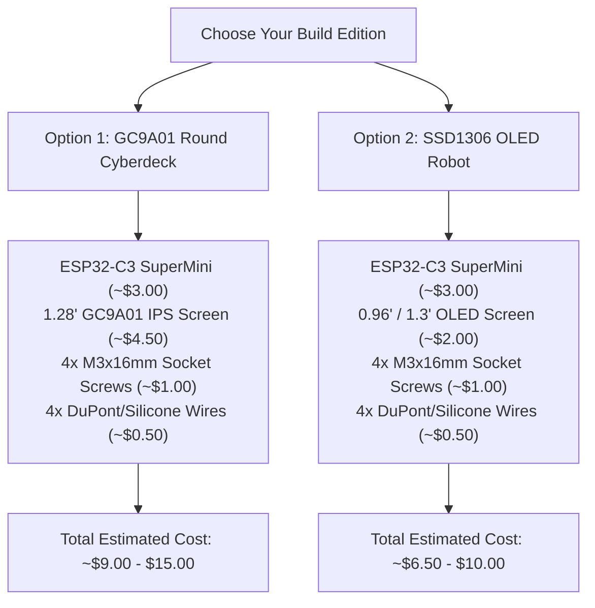

# 🛒 Bill of Materials (BOM) & Purchasing Guide

Welcome to the hardware sourcing guide for **Tiny AI Limits & Desktop Companion**!

This guide lists all the electronic components, hardware fasteners, wiring, and 3D printing supplies needed to assemble your device, along with verified purchasing links across global retailers (**Amazon US/EU**, **AliExpress**, **Waveshare**, and **Adafruit**).

---

## 📦 Quick-Start Shopping Kits

Choose the kit for the edition you want to build:

---

## 📋 Comprehensive Parts List

For full part numbers, direct links, and component notes, see the dedicated [**`BOM.md`**](./BOM.md) file.

### 1. Option 1: 1.28" Circular IPS Cyberdeck Edition

| Component | Quantity | Key Spec | Estimated Price |
| :--- | :---: | :--- | :---: |
| **ESP32-C3 SuperMini** | 1 | USB-C, RISC-V, Wi-Fi 4 + BLE 5, 3.3V | $2.50 – $4.00 |
| **GC9A01 1.28" Round IPS LCD** | 1 | 240×240 SPI (8-pin or 7-pin header) | $3.80 – $6.00 |
| **M3 × 16mm Socket Head Screws** | 4 | Brass or Black Oxide Stainless Steel | $1.00 |
| **Hookup Wires / DuPont Jumpers** | 7–8 | 28/30 AWG flexible silicone (10cm) | $0.50 |
| **Rubber Bumper Feet** | 4 | 6mm–8mm self-adhesive silicone pads | $0.50 |
| **USB-C Data Cable** | 1 | USB-A to USB-C or USB-C to USB-C | Existing / $2.00 |

### 2. Option 2: 0.96" / 1.3" Monochrome OLED Robot Edition

| Component | Quantity | Key Spec | Estimated Price |
| :--- | :---: | :--- | :---: |
| **ESP32-C3 SuperMini** | 1 | USB-C, RISC-V, Wi-Fi 4 + BLE 5, 3.3V | $2.50 – $4.00 |
| **SSD1306 0.96" I2C OLED** | 1 | 128×64 Monochrome (4-pin: GND, VCC, SCL, SDA) | $1.80 – $3.00 |
| **M3 × 16mm Socket Head Screws** | 4 | Brass or Black Oxide Stainless Steel | $1.00 |
| **Hookup Wires / DuPont Jumpers** | 4 | 28/30 AWG flexible silicone (10cm) | $0.30 |
| **Rubber Bumper Feet** | 4 | 6mm–8mm self-adhesive silicone pads | $0.50 |
| **USB-C Data Cable** | 1 | USB-A to USB-C or USB-C to USB-C | Existing / $2.00 |

---

## 🖨️ 3D Printing Materials

* **Main Enclosure & Stand Trunk:** Matte Charcoal, Gunmetal Gray, or Galaxy Black PLA / PETG / ABS.
* **Tier 1 Stand Base Plate (Optional):** Wood PLA (Dark Walnut or Pine) for an organic contrast finish, or standard Black PLA.
* **Slicer Settings:**
  * Layer Height: `0.16mm` or `0.20mm`
  * Infill: `15% - 20%` (Gyroid or Grid)
  * Supports: **None needed** (all models designed 100% support-free with 45° self-supporting chamfers)

---

## 🛠️ Recommended Tools

* 2.5mm Hex / Allen Key (for M3 socket head screws)
* Soldering iron (only needed if your ESP32-C3 or display module ships without pre-soldered header pins)
* Wire stripper / snips (if using bare silicone hookup wire)
