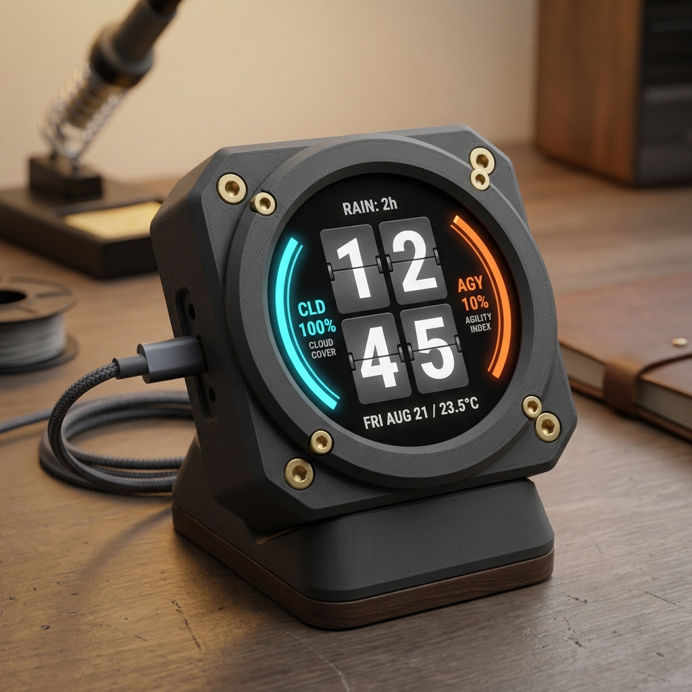
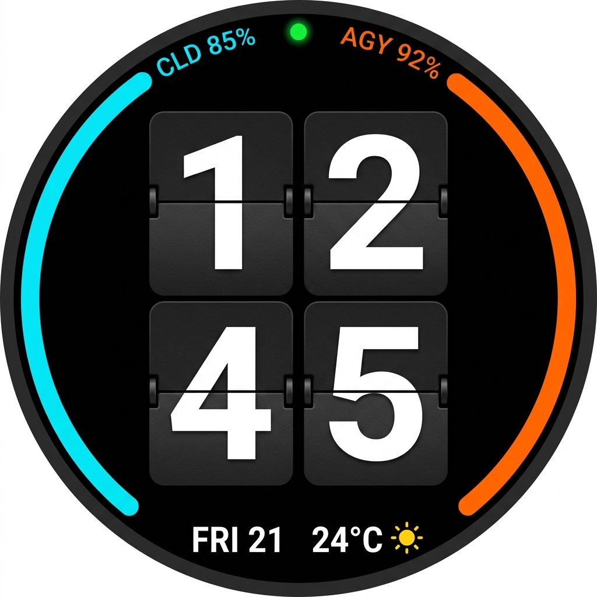

# 🔘 GC9A01 1.28″ Round Display Cyberdeck (240×240)

An ultra-compact desktop telemetry HUD and 2×2 mechanical split-flap flip clock designed for the **GC9A01 1.28″ circular IPS display (240×240)** powered by the **ESP32-C3 SuperMini**.



---

## 🌟 Features

* **Center 2×2 Split-Flap Clock:** Vintage mechanical flip digits (`12` top / `45` bottom) with tall $46\times 68\text{px}$ aspect ratio, dual-tone split creases, side hinge pin brackets, and animated 3D flap perspective folding.
* **Dual Flanking Radial Telemetry Gauges:**
  * **Left Gauge (Cyan):** Claude AI Quota remaining ($0\%$ at bottom $\to 100\%$ at top) with curved inside label `CLD %`.
  * **Right Gauge (Orange):** Antigravity Quota remaining ($0\%$ at bottom $\to 100\%$ at top) with curved inside label `AGY %`.
* **Top Crown Rain Metric:** Real-time weather integration indicating hours until next rain (`RAIN: 2h 🌧️` / `NO RAIN ☀️` / `RAIN NOW 🌧️`).
* **Stacked Bottom Sub-HUD:**
  * Line 1: Day & Date (`FRI AUG 21`)
  * Line 2: Live Temperature & Weather Icon (`23.5°C ☀️`)
  * Dynamic Alert Override: `⚠️ AGENT ALERT` + `APPROVE PLAN` with pulsing outer watch bezel.
* **Interactive Browser Emulator:** Full simulation at `http://localhost:5000/round` with screen type switcher, live telemetry sliders, and instant manual flip triggers.



---

## 🖨️ 3D Printed Cyberdeck Enclosure

All 3D printable STL files and parametric CAD models are located in [`enclosure/`](enclosure/):

* **[`gc9a01_front_bezel.stl`](enclosure/gc9a01_front_bezel.stl):** Front plate with circular retention lip and counterbored M2 screw pockets.
* **[`gc9a01_main_housing.stl`](enclosure/gc9a01_main_housing.stl):** $22\text{mm}$ deep chassis with cavity for the ESP32-C3 SuperMini and USB-C port cutout.
* **[`gc9a01_desk_stand.stl`](enclosure/gc9a01_desk_stand.stl):** $20^\circ$ ergonomic angled desk base with cable relief channel.
* **[`gc9a01_cyberdeck_enclosure.scad`](enclosure/gc9a01_cyberdeck_enclosure.scad):** Parametric OpenSCAD source file.

---

## 🔌 Hardware Pinout (GC9A01 to ESP32-C3 SuperMini)

| GC9A01 Pin | ESP32-C3 SuperMini Pin | Function | Notes |
| :--- | :--- | :--- | :--- |
| **VCC** | `3V3` | Power Input | $3.3\text{V}$ Logic & Power |
| **GND** | `GND` | Ground | Common Ground |
| **SCL / SCK** | `GPIO 4` | SPI Clock | Hardware SPI SCLK |
| **SDA / MOSI** | `GPIO 6` | SPI MOSI | Hardware SPI Master Out |
| **DC** | `GPIO 7` | Data / Command | Command/Data Selection |
| **CS** | `GPIO 5` | Chip Select | Active Low |
| **RST** | `GPIO 1` | Hardware Reset | Active Low |
| **BLK / LED** | `3V3` or `GPIO 0` | Backlight | PWM Dimmable on GPIO 0 |

---

## 🚀 Running the Emulator

1. Start the Flask telemetry backend:
   ```bash
   python backend/app.py --server-only
   ```
2. Open your browser:
   * **Round Screen Direct:** [http://localhost:5000/round](http://localhost:5000/round)
   * **Main Emulator:** [http://localhost:5000/emulator](http://localhost:5000/emulator)
