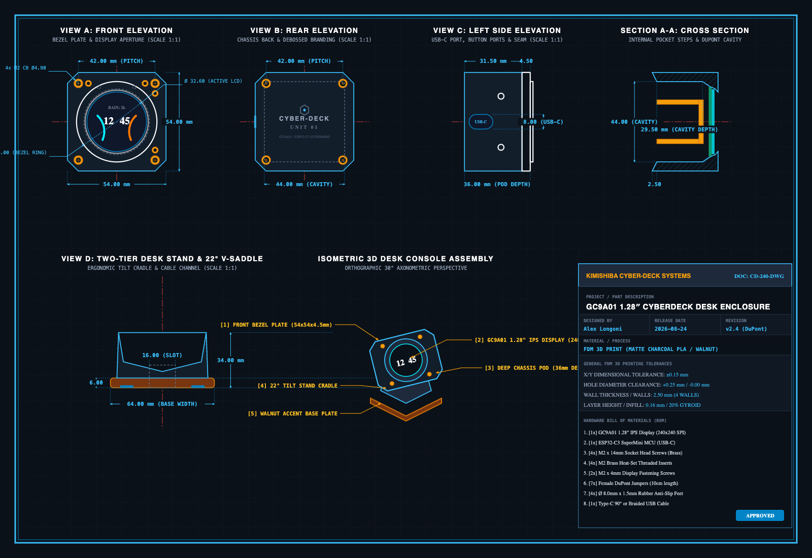
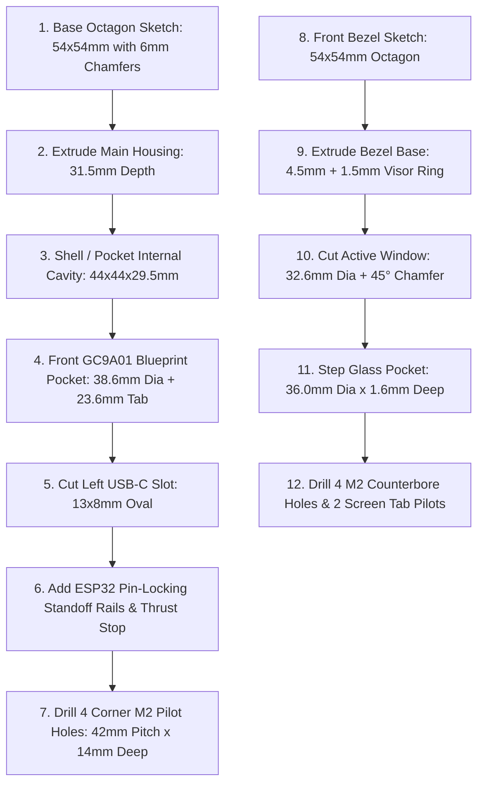

# 📐 GC9A01 1.28″ Cyberdeck Desk Enclosure — Technical Drawing & CAD Specification

**Document ID:** `DOC: CD-240-DWG`  
**Revision:** `v2.4 (DuPont-Cleared Edition)`  
**Source Vector Blueprint:** [`gc9a01_cyberdeck_technical_drawing.svg`](gc9a01_cyberdeck_technical_drawing.svg)  
**High-Resolution Render:** [`gc9a01_cyberdeck_technical_drawing.png`](gc9a01_cyberdeck_technical_drawing.png)  
**Parametric CAD Source:** [`gc9a01_cyberdeck_enclosure.scad`](gc9a01_cyberdeck_enclosure.scad)  
**Direct 3D Mesh Generator:** [`generate_stl.py`](generate_stl.py)

---

## 🖼️ Multi-View Engineering Blueprint

---

## 🎯 Coordinate Origin & Datum System

* **Primary Coordinate Datum $(0, 0, 0)$:** Center of the front display glass aperture on the front face of the bezel plate.
* **$X$-Axis:** Horizontal (Left $-X$, Right $+X$).
* **$Y$-Axis:** Vertical (Bottom $-Y$, Top $+Y$).
* **$Z$-Axis:** Depth (Front Bezel Face $+Z$, Rear Wall $-Z$).

---

## 📐 Dimensional Specification by View

### 1. View A: Front Elevation (Bezel Plate)
* **Outer Profile:** Chamfered Square / Octagon: $54.00\text{mm} \times 54.00\text{mm}$.
* **Corner Chamfers:** $4 \times 6.00\text{mm} \times 45^\circ$.
* **Raised Visor Trim Ring:** $\varnothing 44.00\text{mm}$ outer diameter, height $+1.50\text{mm}$ ($Z = 4.5\text{mm} \to 6.0\text{mm}$).
* **Active Display Window Aperture:** $\varnothing 32.60\text{mm}$ through-hole with an inner $45^\circ$ viewing chamfer expanding to $\varnothing 34.60\text{mm}$ on the front.
* **Glass Retention Recess Step:** $\varnothing 36.00\text{mm} \times 1.60\text{mm}$ deep (locates the $35.6\text{mm}$ display glass lens).
* **Primary Corner Fastener Array:** 
  * 4 Holes at $(X, Y) = (\pm 21.00\text{mm}, \pm 21.00\text{mm})$ ($42.00\text{mm}$ square pitch).
  * Through-hole: $\varnothing 2.60\text{mm}$ (M2 / M2.5 clearance).
  * Counterbore Head Pocket: $\varnothing 4.80\text{mm} \times 2.20\text{mm}$ deep.
* **Secondary Accent Screw Pockets:**
  * Paired brass screw pockets at $(+15.5, -21.0)$, $(+21.0, -15.5)$, $(-15.5, -21.0)$, $(+21.0, +15.5)\text{mm}$.
  * Recess: $\varnothing 3.40\text{mm} \times 1.20\text{mm}$ deep with $\varnothing 1.80\text{mm}$ pilot.
* **Direct Screen Fastening Holes:**
  * 2 M2 pilot holes on rear of bezel at $(X = \pm 9.63\text{mm}, Y = -18.91\text{mm})$.
  * Thread depth: $3.20\text{mm}$, hole diameter: $\varnothing 1.80\text{mm}$.

---

### 2. View B: Rear Elevation (Chassis Back)
* **Chassis Outer Profile:** $54.00\text{mm} \times 54.00\text{mm}$ with $6.00\text{mm} \times 45^\circ$ corner chamfers.
* **Rear Wall Thickness:** $2.50\text{mm}$ solid floor.
* **Rear Corner Threaded Insert Sockets:**
  * 4 Pockets at $(X, Y) = (\pm 21.00\text{mm}, \pm 21.00\text{mm})$.
  * M2 Brass Insert Bore: $\varnothing 3.20\text{mm} \times 4.00\text{mm}$ deep with $\varnothing 4.80\text{mm}$ outer collar.
* **Debossed Branding Area:**
  * **Hex Circuit Icon:** Width $16.00\text{mm}$, centered at $(0, +23.00\text{mm})$, depth $0.60\text{mm}$.
  * **Typography Line 1:** `"CYBER-DECK"` (Font Height: $3.50\text{mm}$, Tracking: $+2.0$, depth $0.50\text{mm}$).
  * **Typography Line 2:** `"UNIT 01"` (Font Height: $2.80\text{mm}$, Tracking: $+3.0$, depth $0.50\text{mm}$).

---

### 3. View C: Left Side Elevation (Ports & Profile)
* **Total Assembly Pod Depth:** $36.00\text{mm}$.
  * Front Bezel Plate Thickness: $4.50\text{mm}$ ($+1.50\text{mm}$ raised ring = $6.00\text{mm}$ total).
  * Main Housing Chassis Depth: $31.50\text{mm}$.
* **USB-C Port Cutout:**
  * Dimensions: $13.00\text{mm}$ wide (along $Y$) $\times 8.00\text{mm}$ tall (along $Z$).
  * Corner Radius: $R = 4.00\text{mm}$ (Full stadium oval).
  * Center Position: $X = -27.00\text{mm}$ (outer left face), $Y = 0.00\text{mm}$, $Z = 9.00\text{mm}$ from back face.
* **Side Tactile Button / LED Ports:**
  * 2 Ports: $\varnothing 3.20\text{mm}$ at $Y = \pm 14.00\text{mm}$, $Z = 20.00\text{mm}$ from back face.

---

### 4. Section A-A: Internal Cavity Cross-Section
* **Main Electronics Cavity:** $44.00\text{mm} \times 44.00\text{mm} \times 29.50\text{mm}$ usable interior depth.
* **DuPont Connector Clearance:** Provides $>28\text{mm}$ vertical/horizontal clearance for standard $14.0\text{mm}$ female DuPont housings.
* **GC9A01 Display Pocket (Front):**
  * Circular PCB Section: $\varnothing 38.60\text{mm} \times 4.00\text{mm}$ deep.
  * Connector Tab Extension: $23.60\text{mm}$ wide $\times 26.80\text{mm}$ long from center.
* **ESP32-C3 SuperMini Mounting Rails:**
  * Standoff Height: $2.50\text{mm}$ above rear floor (solder joint clearance).
  * Rail Spacing: Centered along pin rows at $Y = \pm 7.62\text{mm}$ ($15.24\text{mm} / 0.60\text{″}$ pitch).
  * **16 Pin-Locking Registration Holes:** 2 rows of 8 holes ($\varnothing 1.50\text{mm} \times 2.00\text{mm}$ deep, $2.54\text{mm} / 0.10\text{″}$ pitch).
  * **Rear Mechanical Thrust Stop:** $+X$ end stop block ($2.50\text{mm} \times 18.40\text{mm} \times 5.50\text{mm}$) absorbing Type-C insertion force.

---

### 5. View D: Two-Tier Desk Stand & 22° V-Saddle
* **Base Footprint (Tier 1):** $64.00\text{mm} \times 68.00\text{mm} \times 6.00\text{mm}$ with $R = 6.00\text{mm}$ rounded corners.
* **Pyramidal Trunk (Tier 2):** Height $28.00\text{mm}$, tapering from $58\text{mm} \times 58\text{mm}$ to $54\text{mm} \times 54\text{mm}$ top.
* **Ergonomic Cradle Tilt Angle:** $22.00^\circ$ backward incline.
* **V-Saddle Pocket Dimensions:** Octagonal cutout $54.80\text{mm} \times 40.00\text{mm} \times 6.20\text{mm}$ chamfer.
* **Rear Cable Pass-Through Channel:** $16.00\text{mm}$ wide $\times 14.00\text{mm}$ tall.
* **Underside Anti-Slip Foot Recesses:** 4 Pockets $\varnothing 8.20\text{mm} \times 1.40\text{mm}$ deep at $(X, Y) = (\pm 22.00\text{mm}, \pm 24.00\text{mm})$.

---

## 🛠️ Recommended CAD Reconstruction Steps (Fusion 360 / SolidWorks / FreeCAD)

---

## 🔩 Hardware Fastener & Bill of Materials Table

| Ref | Component | Spec / Dimensions | Qty | Mounting Location |
| :---: | :--- | :--- | :---: | :--- |
| **1** | GC9A01 LCD Module | 1.28″ Round IPS SPI ($240\times 240$) | 1 | Front stepped pocket |
| **2** | ESP32-C3 SuperMini | RISC-V 160MHz MCU with USB-C | 1 | Internal bottom rails |
| **3** | Bezel Fastening Screws | $\text{M2} \times 14\text{mm}$ Socket Cap (Brass) | 4 | Corner holes into housing |
| **4** | Threaded Heat-Set Inserts | $\text{M2} \times 3.5\text{mm}$ Brass Inserts | 4 | Housing corner posts |
| **5** | Display Tab Screws | $\text{M2} \times 4\text{mm}$ Self-tapping or Machine | 2 | Bezel rear tab pilots |
| **6** | Wiring Harness | 7-Pin Female-to-Female DuPont ($10\text{cm}$) | 7 | SPI internal loop |
| **7** | Anti-Slip Desk Bumpers | $\varnothing 8.0\text{mm} \times 1.5\text{mm}$ Silicone/Rubber | 4 | Base plate underside pockets |
| **8** | USB Power Cable | USB-C Right-Angle or Braided Type-C | 1 | Left-side port routing |

---

## 🖨️ FDM 3D Printing Guidelines

* **No Supports Required:**
  * **Front Bezel:** Print face-down on smooth/textured PEI sheet.
  * **Main Housing:** Print with rear face flat on build plate (open pocket facing $+Z$).
  * **Desk Stand:** Print base-down with V-saddle pointing up.
* **Filament Recommendation:** Matte Charcoal Black PLA / PETG (body) + Walnut Wood PLA (Tier 1 base plate).
