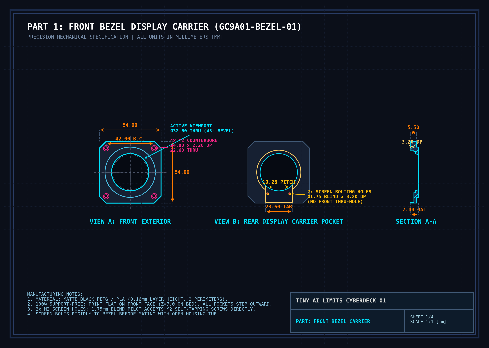
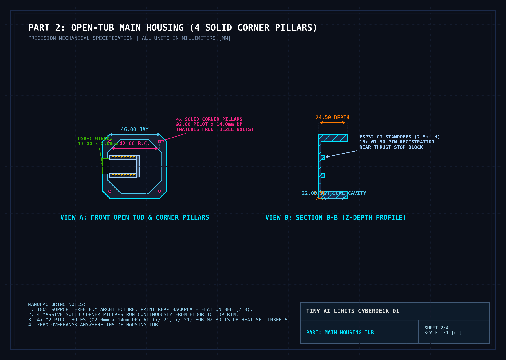
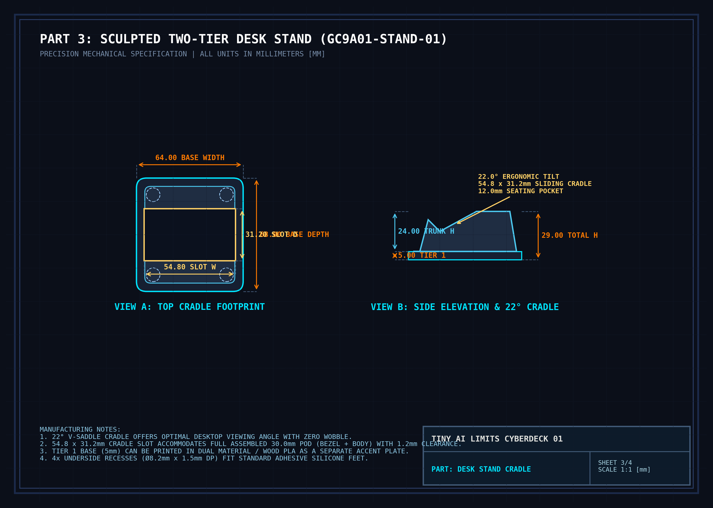
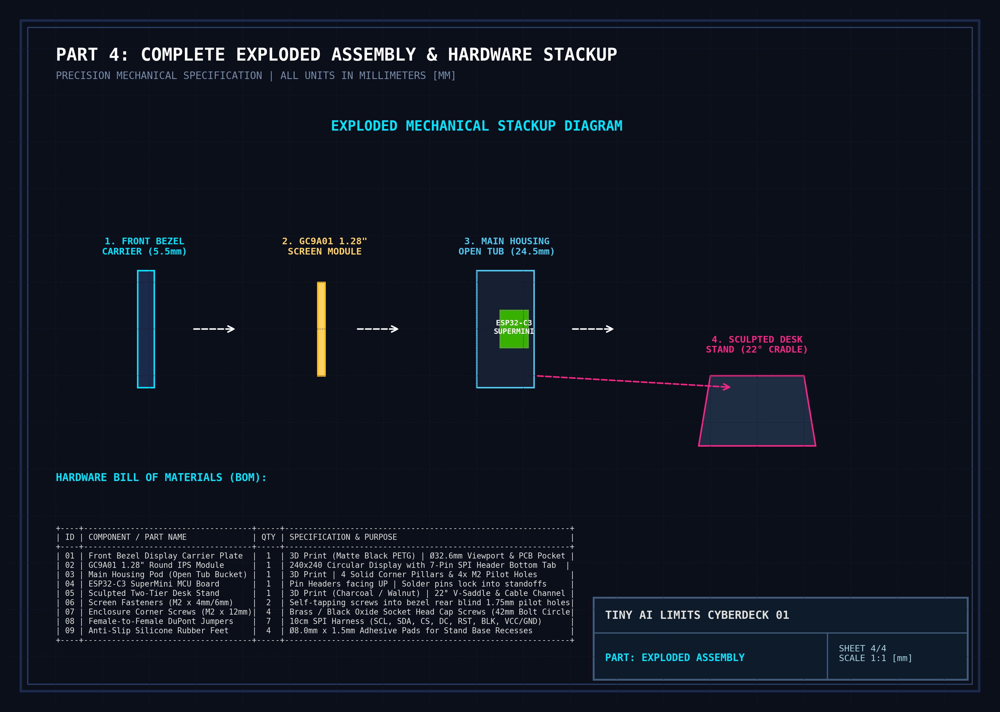

# 📐 GC9A01 Cyberdeck Enclosure - Mechanical Engineering Technical Drawings

Comprehensive mechanical engineering drawing sheets and dimensional specifications for CAD modeling (Fusion 360, FreeCAD, SolidWorks, Blender, Onshape, Rhino).

---

## 📑 Drawing Sheets Overview

### 1. Sheet 1: Front Bezel Display Carrier (`GC9A01-BEZEL-01`)

* **Function:** Precision carrier holding the display glass, PCB, and retaining screws flush.
* **Outer Profile:** $54.00\text{mm} \times 54.00\text{mm}$ with $6.00\text{mm} \times 45^\circ$ corner chamfers.
* **Plate Thickness:** $5.50\text{mm}$ carrier body $+ 1.50\text{mm}$ raised decorative trim ring ($\varnothing 44.00\text{mm}$) = $7.00\text{mm}$ Overall Length (OAL).
* **Active Screen Viewport:** $\varnothing 32.60\text{mm}$ through-hole with $45^\circ$ inner bevel ring (aperture dia $\varnothing 30.60\text{mm}$).
* **Glass Lens Retention Step:** $\varnothing 36.00\text{mm} \times 1.60\text{mm}$ deep (from rear).
* **Full PCB Retention Pocket:** $\varnothing 38.60\text{mm}$ circular top $+ 23.60\text{mm}$ wide bottom tab down to $Y = -26.50\text{mm}$ ($3.20\text{mm}$ deep into bezel from rear).
* **Screen Bolting Pilot Holes:** $2 \times \varnothing 1.75\text{mm}$ blind pilot holes at $X = \pm 9.63\text{mm}, Y = -18.91\text{mm}$ ($19.26\text{mm}$ pitch), depth $3.20\text{mm}$ from rear (leaves solid front face).
* **Corner Enclosure Screws:** $4 \times$ M2 through-holes ($\varnothing 2.60\text{mm}$) with counterbore pockets ($\varnothing 4.80\text{mm} \times 2.20\text{mm}$ deep) at $X = \pm 21.00\text{mm}, Y = \pm 21.00\text{mm}$ ($42.00\text{mm}$ Bolt Circle).
* **3D Print Orientation:** Print flat on front face ($Z = 7.0\text{mm}$ on bed). **Zero supports required.**

---

### 2. Sheet 2: Main Housing Pod (Open Tub - 100% Support-Free) (`GC9A01-BODY-26`)

* **Function:** Open electronics bucket with continuous vertical walls and zero mid-air ceilings.
* **Outer Profile:** $54.00\text{mm} \times 54.00\text{mm} \times 24.50\text{mm}$ depth with $6.00\text{mm} \times 45^\circ$ corner chamfers.
* **Solid Enclosed Bottom Wall:** 100% continuous, solid outer perimeter walls (zero exterior bottom slits or holes).
* **Electronics & Wire Cavity:** $44.00\text{mm} \times 44.00\text{mm} \times 22.00\text{mm}$ continuous vertical open tub from floor ($Z = 2.5\text{mm}$) to top rim ($Z = 24.5\text{mm}$).
* **Corner Screw Pillars:** $4 \times \varnothing 7.60\text{mm}$ solid pillars running from floor to rim with $\varnothing 2.00\text{mm} \times 12.00\text{mm}$ pilot holes.
* **Internal Lower Tab Pocket:** $23.60\text{mm} \text{ wide} \times 5.00\text{mm} \text{ deep}$ internal pocket ($Y = -22.00\text{mm} \to -25.50\text{mm}$) inside the shell, maintaining a solid $1.50\text{mm}$ bottom outer wall.
* **USB-C Side Window:** $13.00\text{mm} \text{ wide} \times 8.00\text{mm} \text{ tall}$ through left wall at $X = -27.00\text{mm}$.
* **ESP32-C3 SuperMini Mounting:**
  * Standoff rails at $Y = \pm 7.62\text{mm}$ ($0.6''$ pin row spacing), height $2.50\text{mm}$.
  * $16 \times \varnothing 1.50\text{mm}$ blind pin-registration holes ($2.00\text{mm}$ deep) at $2.54\text{mm}$ pitch along $X$.
  * Rear mechanical thrust stop block ($2.50\text{mm}$ thick) at $+X$ end.
* **3D Print Orientation:** Print flat on rear backplate ($Z = 0$ on bed). **Zero supports required.**

---

### 3. Sheet 3: Sculpted Two-Tier Desk Stand (`GC9A01-STAND-01`)

* **Tier 1 Base Plate:** $64.00\text{mm} \text{ wide} \times 68.00\text{mm} \text{ deep} \times 5.00\text{mm} \text{ height}$ with $R = 6.00\text{mm}$ rounded corners and $4 \times$ upward alignment pins ($\varnothing 5.00\text{mm} \times 3.50\text{mm}$).
* **Tier 2 Pyramidal Trunk:** $24.00\text{mm}$ height ($62.0\times 66.0\text{mm}$ base tapering to $54.0\times 58.0\text{mm}$ top) for a $29.00\text{mm}$ total stand height.
* **Cradle Sliding Slot:** $54.80\text{mm} \text{ wide} \times 31.20\text{mm} \text{ depth} \times 12.00\text{mm} \text{ seating pocket}$ at an ergonomic **$22.0^\circ$ backward tilt**, accommodating the full $30.00\text{mm}$ assembled pod (housing + bezel) with $1.20\text{mm}$ smooth slide clearance.
* **Anti-Slip Rubber Foot Recesses:** $4 \times \varnothing 8.20\text{mm} \times 1.50\text{mm}$ deep on underside ($X = \pm 22.00\text{mm}, Y = \pm 24.00\text{mm}$).

---

### 4. Sheet 4: Exploded System Assembly & Hardware BOM

* **Stackup Sequence:**
  1. Front Bezel Display Carrier ($5.50\text{mm}$)
  2. GC9A01 1.28″ Round Display Module ($3.10\text{mm}$) — fastened to bezel with $2 \times$ M2 screws
  3. Main Housing Pod Open Tub ($24.50\text{mm}$) with ESP32-C3 SuperMini inside
  4. Sculpted Two-Tier Desk Stand ($34.00\text{mm}$)
* **Hardware BOM:**
  * $2 \times \text{M2} \times 4\text{mm} / 6\text{mm}$ pan/socket screws (screen to bezel)
  * $4 \times \text{M2} \times 12\text{mm}$ socket head cap screws (bezel to housing)
  * $4 \times \varnothing 8.0\text{mm}$ adhesive rubber feet
  * $7 \times 10\text{cm}$ female-to-female DuPont jumper wires
