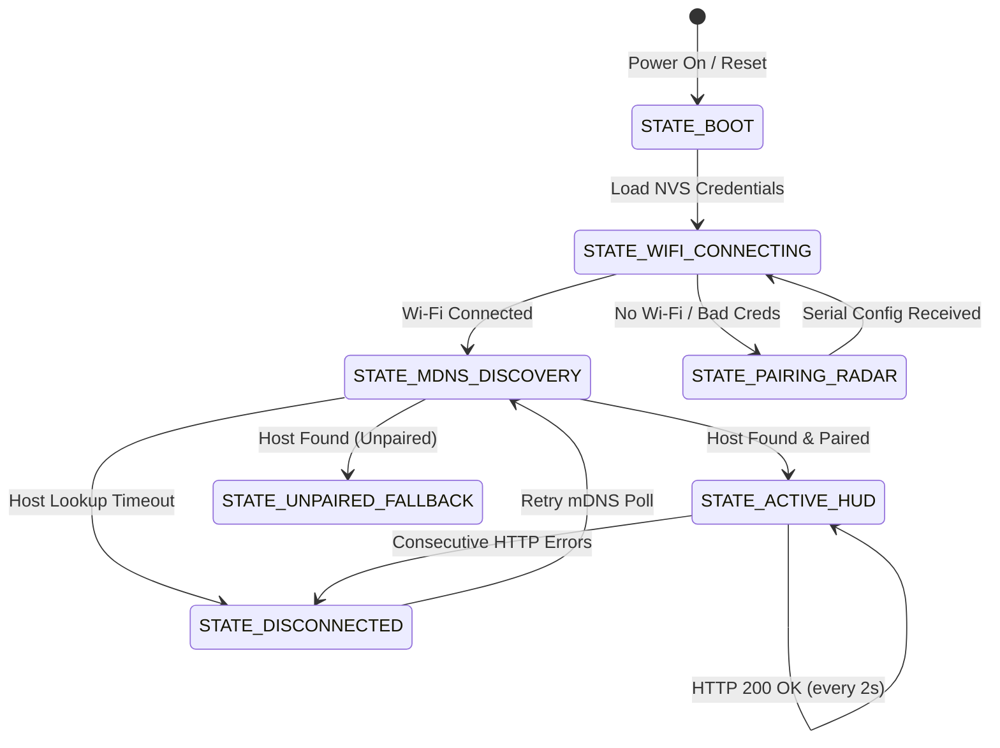

# 💻 Firmware Architecture & Internals

The **Tiny AI Limits** firmware is written in C++ for the ESP32-C3 microcontroller using the Arduino framework and **PlatformIO**. It features a non-blocking rendering engine, hardware-accelerated SPI communication, smooth antialiased circular HUD math, and low-latency mDNS network discovery.

---

## 🛠️ Build System & PlatformIO Configuration

The project uses `platformio.ini` to declare hardware architecture, compiler optimizations, and pin definitions for `TFT_eSPI` directly in `build_flags`:

```ini
[env:esp32-c3-supermini]
platform = espressif32
board = esp32-c3-devkitm-1
framework = arduino
monitor_speed = 115200
board_build.flash_mode = dio
board_build.f_flash = 80000000L
board_build.f_cpu = 160000000L

lib_deps =
    bodmer/TFT_eSPI@^2.5.43
    bblanchon/ArduinoJson@^7.0.0
    ESPmDNS

build_flags =
    -DUSER_SETUP_LOADED=1
    -DGC9A01_DRIVER=1
    -DTFT_WIDTH=240
    -DTFT_HEIGHT=240
    -DTFT_MISO=-1
    -DTFT_MOSI=6
    -DTFT_SCLK=4
    -DTFT_CS=5
    -DTFT_DC=7
    -DTFT_RST=1
    -DTFT_BL=0
    -DSPI_FREQUENCY=40000000
```

---

## 🎨 Graphics Pipeline & Double-Buffered Sprites

To eliminate screen tearing and flickering on the 240×240 circular display, all HUD elements are rendered into off-screen **`TFT_eSprite`** memory buffers in the ESP32-C3 internal SRAM before being pushed via DMA/Hardware SPI to the GC9A01 controller.

```
 ┌─────────────────────────────────────────────────────────────┐
 │                      ESP32-C3 SRAM                          │
 │                                                             │
 │  ┌───────────────────────────────────────────────────────┐  │
 │  │                 TFT_eSprite HUD Layer                 │  │
 │  │                                                       │  │
 │  │   [Radial Arcs]       [Text Glyphs]   [Mascot Frame]  │  │
 │  │        │                    │               │         │  │
 │  │        └──────────────┬─────┴───────────────┘         │  │
 │  │                       ▼                               │  │
 │  │              Rendered HUD Buffer (240x240)            │  │
 │  └───────────────────────┬───────────────────────────────┘  │
 └──────────────────────────┼──────────────────────────────────┘
                            ▼ High-Speed SPI (40 MHz)
 ┌─────────────────────────────────────────────────────────────┐
 │            GC9A01 Controller Framebuffer                    │
 │               (Circular 240×240 IPS Panel)                  │
 └─────────────────────────────────────────────────────────────┘
```

---

## 📐 Radial Arc Trigonometric Math

The dual gauge HUD renders continuous arcs spanning from $135^\circ$ to $405^\circ$ ($270^\circ$ sweep) or twin $180^\circ$ semi-circles.

### Arc Coordinate Projection Formula
For a given center $(x_0, y_0)$ and radius $r$, points on the radial arc at angle $\theta$ (in radians) are calculated as:

$$x = x_0 + r \cdot \cos(\theta)$$
$$y = y_0 + r \cdot \sin(\theta)$$

In the firmware, angles are interpolated linearly between starting angle $\theta_{\text{start}}$ and ending angle $\theta_{\text{end}}$ corresponding to normalized percentage $p \in [0.0, 1.0]$:

$$\theta(p) = \theta_{\text{start}} + p \cdot (\theta_{\text{end}} - \theta_{\text{start}})$$

Smooth segmented antialiasing is achieved by stepping in $\Delta\theta \approx 1^\circ$ increments, drawing thick line segments between inner radius $r_{\text{inner}}$ and outer radius $r_{\text{outer}}$.

---

## 🚦 Firmware State Machine

The main execution loop operates as an asynchronous, non-blocking finite state machine (FSM):



### State Definitions
1. **`STATE_BOOT`:** Initializes hardware GPIOs, SPI bus, TFT display, loads saved configuration from Non-Volatile Storage (NVS).
2. **`STATE_WIFI_CONNECTING`:** Attempts connection to stored SSID. Displays connecting spinner.
3. **`STATE_PAIRING_RADAR`:** Activated when no Wi-Fi credentials exist. Listens for WebSerial configuration and pulses the radar ring.
4. **`STATE_MDNS_DISCOVERY`:** Queries the local subnet for `_tinyscreen._tcp` services to resolve the host companion IP address.
5. **`STATE_ACTIVE_HUD`:** Actively polls `/api/limits` every 2000ms. Renders the real-time agent matrix, dual arcs, weather crown, and alert indicators.
6. **`STATE_DISCONNECTED`:** Triggered if 3 consecutive HTTP poll attempts fail. Renders red status crown and retries mDNS host resolution.

---

## 💾 Non-Volatile Storage (NVS Preferences)

The firmware uses the ESP32 `Preferences` library (stored in the flash NVS partition) to maintain persistent state across power cycles:

| Key | Type | Description |
| :--- | :--- | :--- |
| `wifi_ssid` | `String` | Wi-Fi network SSID |
| `wifi_pass` | `String` | Wi-Fi WPA2 pre-shared key |
| `pair_id` | `String` | UUIDv4 token matching the host companion app |
| `host_ip` | `String` | Last known static/cached IP address of the host |
| `gauge_l` | `String` | Left gauge provider identifier (e.g. `claude`) |
| `gauge_r` | `String` | Right gauge provider identifier (e.g. `antigravity`) |

---

## ⚡ Serial Command Protocol

In addition to standard Improv Wi-Fi serial frames, the ESP32 firmware accepts ASCII commands over USB-C CDC:

* `WIFI:<ssid>:<password>:<pair_id>\n` — Stores Wi-Fi credentials and binds the board to the provided host `pair_id`.
* `PAIR:<pair_id>\n` — Updates or overrides the paired host UUID without changing Wi-Fi credentials.
* `INFO?\n` — Returns board MAC address, firmware version, IP address, and current pairing status.
* `RESET\n` — Clears NVS preferences and reboots into setup mode.
