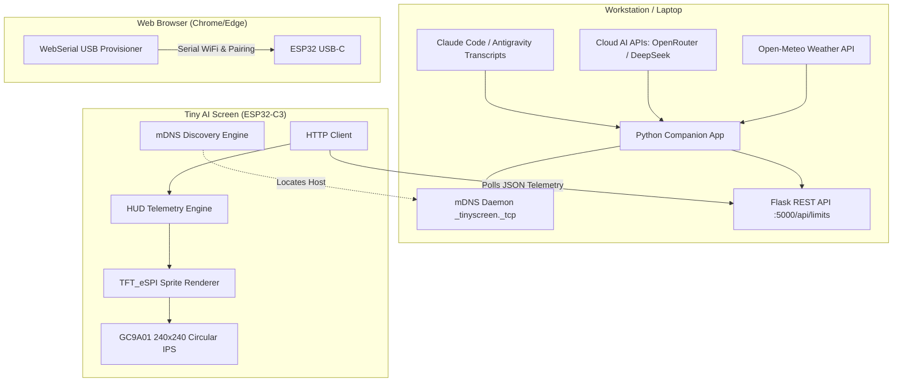

# Welcome to the Tiny AI Limits Wiki

**Tiny AI Limits** (also known as **Tiny AI Screen**) is an open-source, ultra-compact physical desktop telemetry HUD. Powered by an **ESP32-C3 SuperMini** microcontroller and a vibrant **GC9A01 240×240 circular IPS display**, it provides continuous, ambient visibility into your AI coding workflows, token quotas, agent state lifecycles, and environmental context.

```
                  ┌─────────────────────────────────┐
                  │       TINY AI SCREEN HUD        │
                  │                                 │
                  │      ╭───────────────────╮      │
                  │    ╭─╯  TOP CROWN ARC    ╰─╮    │
                  │   ╭╯   (Weather / Rain)   ╰╮    │
                  │  ╭╯                        ╰╮   │
                  │  │ [CLAUDE]        [AGY]    │   │
                  │  │  84% LEFT      $0.12     │   │
                  │  │ (5h Reset)   (Daily Lim) │   │
                  │  │ ──────────────────────── │   │
                  │  │ AGENT 1: WAITING  (Gray) │   │
                  │  │ AGENT 2: WORKING  (Blue) │   │
                  │  │ AGENT 3: COMPLETE (Grn)  │   │
                  │  ╰╮                        ╭╯   │
                  │   ╰╮   HAZARD ALERT RING  ╭╯    │
                  │    ╰─╮ (Needs Approval!) ╭─╯    │
                  │      ╰───────────────────╯      │
                  │        ESP32-C3 SuperMini       │
                  └─────────────────────────────────┘
```

---

## 🌟 Core Highlights

* **Dual $180^\circ$ Continuous Radial Gauges:** Track any two supported AI providers simultaneously (e.g. Anthropic Claude on the left, Google Antigravity on the right).
* **Multi-Agent 3-Row State Matrix:** Real-time visual matrix displaying subagent lifecycle states (`WAITING`, `WORKING`, `COMPLETE`) with color-coded pulsing badges.
* **Intelligent Plan & Quota Tracking Modes:**
  * **Standard Quota Mode:** Real-time percentage remaining and countdown to the next rolling 5-hour quota reset window (`4h 32m`).
  * **Enterprise Mode:** Live dollar spend tracking (`$0.13`), total 24-hour token volume (`28.2k TOK`), and progress bars measured against a customizable daily budget limit.
* **Agent Approval Ring & Sub-HUD Alert:** High-contrast kinetic amber hazard ring when an agent is awaiting interactive tool approval or user confirmation.
* **Dynamic Weather & Precipitation Crown:** Integrated top-crown arc showing temperature, weather conditions, and rain forecasts from Open-Meteo.
* **Zero-Config mDNS & Secure Host Pairing:** Automatic host discovery via `_tinyscreen._tcp.local.` with cryptographic `pair_id` verification to prevent cross-talk in multi-board office environments.
* **WebSerial Browser Provisioning:** Zero-driver Wi-Fi and gauge configuration directly from Google Chrome or Microsoft Edge via WebSerial.
* **100% Support-Free 3D Printable Enclosure:** Parametric OpenSCAD design with snap-fit bezels, M3 counterbores, and modular two-tier wooden/PLA desk pedestal stands.

---

## 📚 Complete Wiki Documentation

| Chapter | Topic & Overview |
| :--- | :--- |
| 🚀 [[Quick Start Guide\|Quick-Start-Guide]] | 15-minute quickstart from hardware assembly and flashing to backend pairing. |
| 🔌 [[Hardware & Wiring\|Hardware-&-Wiring]] | Complete BOM, ESP32-C3 SuperMini pinouts, GC9A01 SPI schematics, and power rails. |
| 💻 [[Firmware Architecture\|Firmware-Architecture]] | Deep dive into the ESP32 C++ firmware, TFT_eSPI sprites, radial math, and state machines. |
| 🐍 [[Backend Companion App\|Backend-Companion-App]] | Flask architecture, Zero-Config mDNS daemon, REST API schema, and transcript parsers. |
| 🤖 [[AI Providers & Quota Tracking\|AI-Providers-&-Quota-Tracking]] | Complete guide to configuring Claude, Antigravity, OpenRouter, DeepSeek, Groq, Mistral, and more. |
| 🔐 [[Pairing & Multi-Board Setup\|Pairing-&-Multi-Board-Setup]] | Deep dive into `pair_id` handshakes, mDNS TXT records, and crown status indicators. |
| 🌐 [[WebSerial Provisioning & Web UI\|WebSerial-Provisioning-&-Web-UI]] | USB-C serial provisioning, gauge customizer, and real-time browser Canvas emulator. |
| 🖨️ [[3D Printing & Enclosure Assembly\|3D-Printing-&-Enclosure-Assembly]] | OpenSCAD parametric parameters, slicer settings, assembly instructions, and stand models. |
| 🩺 [[Troubleshooting & FAQ\|Troubleshooting-&-FAQ]] | Solutions for flashing errors, SPI glitches, Wi-Fi connectivity, mDNS issues, and quota parsing. |

---

## 🏗️ Architecture Overview



---

## 🤝 Community & Support

* **Source Code Repository:** [GitHub - Kimishiba/Tiny-AI-Limits](https://github.com/Kimishiba/Tiny-AI-Limits)
* **Bug Reports & Feature Requests:** [GitHub Issues](https://github.com/Kimishiba/Tiny-AI-Limits/issues)
* **License:** [MIT License](https://github.com/Kimishiba/Tiny-AI-Limits/blob/main/README.md#license)
